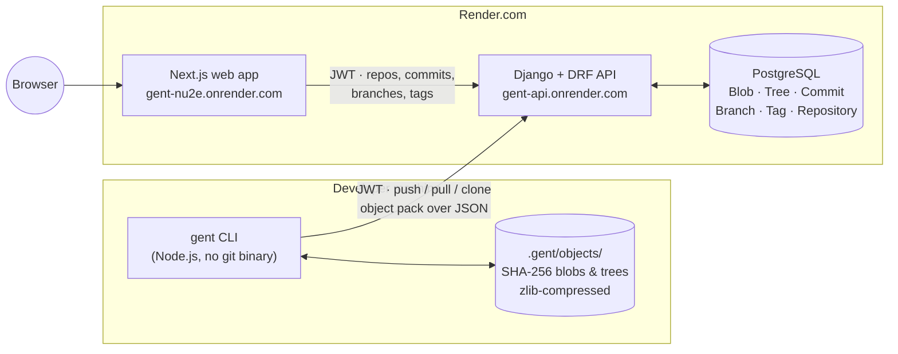

# Gent

Gent is a GitHub-like source-control platform built from scratch: a command-line client, a REST API, and a web UI.

The CLI does not wrap the `git` binary. It implements git's object model itself — files are hashed into **blobs**, directories into **trees**, and history into **commits**, all content-addressed with **SHA-256** (git uses SHA-1) and stored zlib-compressed under `.gent/objects/`. The server stores the same three object types as database rows, so `gent push` transfers a real object pack, not a diff of text.

Live: **[web app](https://gent-nu2e.onrender.com)** · **[API](https://gent-api.onrender.com/api/)** · CLI on npm as [`gent-cli`](https://www.npmjs.com/package/gent-cli)

---

## Architecture



The CLI holds a full local object store, so `init`, `add`, `commit`, `log`, `branch`, `merge`, `diff` and `stash` all work offline. Only `push`, `pull`, `clone` and the account commands need the API.

---

## 5-minute demo

Takes you from an empty folder to a repository visible in the web UI. Uses the live deployment — no local server needed.

> **Account required.** Step 2 is a one-time sign-up. You can register from the CLI (below) or at <https://gent-nu2e.onrender.com/auth/signup>.
> The API is on Render's free tier and cold-starts, so the first authenticated command may take ~30s.

```bash
# 1. Install the CLI
npm install -g gent-cli
gent --version

# 2. Create an account (one time) and sign in
gent register          # prompts for email, password, first/last name
gent login             # prompts for email + password
gent whoami

# 3. Make a repository locally
mkdir gent-demo && cd gent-demo
gent init -y
echo "# Gent demo" > README.md

# 4. Stage and commit — entirely local, no network
gent add -A
gent commit -m "Initial commit"
gent log --oneline

# 5. Create the matching remote repository and link it as 'origin'
gent init --remote gent-demo

# 6. Upload the commit, its tree and its blobs
gent push

# 7. Open it in the web UI
gent web               # or: gent share   (prints the URL only)
```

The repo page has four tabs: **Code**, **Commits**, **Branches**, **Tags**.

Useful afterwards:

```bash
gent status            # working tree vs staging vs HEAD
gent log --graph       # ASCII branch/merge graph
gent config list       # shows api.base_url and web.base_url
gent doctor            # health check: node, repo, auth, backend
gent clone /api/repos/<owner_id>/<repo_name>   # clone it back down
```

Issues and pull requests are **not** implemented — they are out of scope for this version.

---

## Quickstart per app

### `apps/Cli` — Node.js CLI

Requires Node.js >= 18.

```bash
cd apps/Cli
npm install
npm link            # makes `gent` available on PATH from this checkout
npm test            # syntax check + 65 unit tests + offline end-to-end suite
```

Tests use the built-in `node --test` runner (no Jest). `npm run test:unit` and `npm run test:e2e` run the halves separately; `npm run test:remote:e2e` exercises a live backend and needs credentials.

Point the CLI at a local backend with `gent config set api.base_url http://127.0.0.1:8000` (or the `GENT_API_URL` env var); `web.base_url` / `GENT_WEB_URL` does the same for the web app.

### `apps/server` — Django + DRF API

Requires Python 3.11.

```bash
cd apps/server/gent_api
python3 -m venv .venv && source .venv/bin/activate
pip install -r requirements.txt
python3 manage.py migrate
python3 manage.py runserver            # http://127.0.0.1:8000/api/
python3 manage.py test api             # 179 tests
```

Without `DATABASE_URL` set it falls back to local SQLite. See `.env.example` for the full variable list. Auth is JWT (`djangorestframework-simplejwt`); `docker-compose.yml` and a `Dockerfile` are provided, and `render.yaml` at the repo root defines the deployed service and its Postgres database.

### `apps/frontend` — Next.js App Router + Tailwind v4

Requires Node.js 20+.

```bash
cd apps/frontend
npm install
npm run dev            # http://localhost:3000  (/ redirects to /home)
npm run build
npm run lint
```

There is no automated test suite for the frontend. The API base URL is currently hardcoded to the deployed API in `src/lib/axios.ts`, so a local frontend talks to production unless you edit that constant.

---

## Repository layout

| Path | What it is |
| --- | --- |
| `apps/Cli/src/commands/` | One file per CLI command (`init`, `add`, `commit`, `push`, `clone`, `merge`, …) |
| `apps/Cli/src/utils/` | The engine room: `hash-engine.js` (SHA-256 objects), `diff-engine.js`, `merge-engine.js`, `object-store.js`, `journal.js` |
| `apps/Cli/tests/` | `node --test` unit tests plus offline and remote end-to-end scripts |
| `apps/Cli/docs/`, `apps/Cli/final-year-documentation/` | Algorithm, architecture and command write-ups |
| `apps/server/gent_api/api/models.py` | `User`, `Repository`, `Branch`, `Commit`, `Tree`, `Blob`, `Tag`, `RepositoryMember` |
| `apps/server/gent_api/api/urls.py` | Full REST surface (auth, repos, branches, commits, tags, push/pull/clone, tree/blob) |
| `apps/server/gent_api/api/tests/` | Django test suite, one module per feature area |
| `apps/frontend/src/app/` | Next.js App Router routes — marketing pages, `auth/`, `dashboard/` |
| `apps/frontend/src/app/dashboard/repository/[owner_id]/[repo_name]/` | The repository page and its Code/Commits/Branches/Tags tabs |
| `apps/frontend/src/hooks/`, `src/services/` | React Query hooks and the typed API client layer |
| `apps/frontend/docs/` | Per-topic frontend documentation |
| `render.yaml` | Deployment definition for the API service and Postgres database |

---

## Deployments

| Service | URL | Notes |
| --- | --- | --- |
| Web app | <https://gent-nu2e.onrender.com> | `/` returns a 307 redirect to `/home` |
| API | <https://gent-api.onrender.com/api/> | Free tier — first request after idle is slow |
| CLI | `npm install -g gent-cli` | Published as `gent-cli` |
