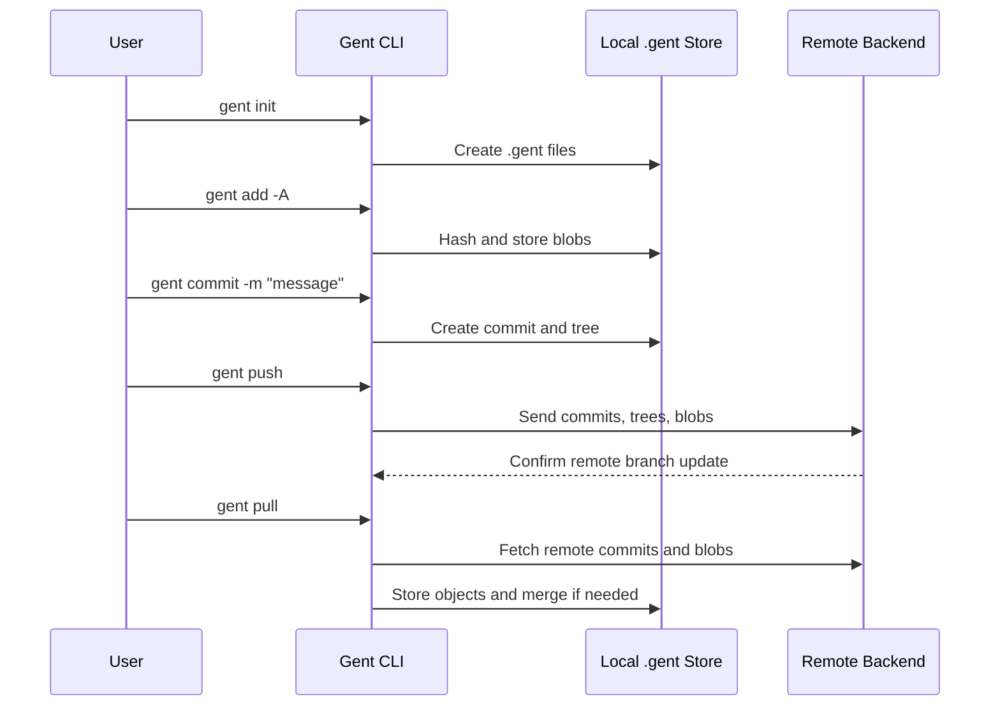

# 01 — Project Overview

## Project Name

Gent CLI

## Project Type

Command-line version control system with cloud synchronization and optional AI-assisted developer tools.

## Short Description

Gent CLI is a Git-like tool that lets developers track changes in a project, create commits, manage branches, merge work, synchronize with a remote backend, and recover from mistakes. It stores repository data locally inside a `.gent/` directory and communicates with a deployed backend API for authentication, repository sharing, pushing, pulling, cloning, and collaboration.

## Problem Statement

Software projects change continuously. Developers need a reliable way to:

- Save project versions.
- Compare old and new files.
- Work on separate branches.
- Merge changes from multiple branches.
- Recover from wrong operations.
- Share repositories through a remote server.

Git solves these problems, but its internals are complex. This project implements a simplified but functional version control system so the internal algorithms are understandable and demonstrable in an academic setting.

## Project Objectives

| Objective | How Gent CLI Solves It |
|---|---|
| Track file versions | Uses SHA-256 content-addressed objects and commits. |
| Detect file changes | Compares working files, staged blobs, and commit trees. |
| Show differences | Uses a Longest Common Subsequence line-diff algorithm. |
| Support branches | Stores branch pointers in `.gent/commits.json`. |
| Merge branches | Uses a three-way diff3 merge algorithm. |
| Handle conflicts | Writes conflict markers and provides `gent resolve`. |
| Recover mistakes | Records history-changing operations in `.gent/journal.json`. |
| Sync online | Sends commits, trees, and blobs to a backend REST API. |
| Authenticate users | Uses JWT access and refresh tokens. |
| Improve usability | Adds setup, doctor, templates, AI review, AI docs, and repo summary commands. |

## Technology Stack

| Area | Technology |
|---|---|
| Runtime | Node.js 18+ |
| CLI framework | Commander.js |
| HTTP client | Axios |
| Terminal UI | Chalk, Ora, Inquirer, Boxen |
| Hashing | Node.js `crypto` SHA-256 |
| Compression | Node.js `zlib` |
| Token/config obfuscation | CryptoJS AES |
| Testing | Node.js built-in test runner |
| Optional AI | Anthropic Messages API via Axios |
| Remote backend | REST API at `https://gent-api.onrender.com` by default |

## Main Features

### 1. Local Version Control

Gent can initialize a repository, stage files, create commits, inspect status, and view history.

Typical workflow:

```bash
gent init
gent add -A
gent commit -m "Initial commit"
gent status
gent log
```

### 2. Content-Addressable Object Store

Files are stored by hash. If two files or versions have the same content, Gent stores the content once and reuses the same hash.

### 3. Diff Engine

Gent compares text files line-by-line using the Longest Common Subsequence algorithm. It then renders a unified diff format similar to Git.

### 4. Branching and Merging

Gent stores branch names as pointers to commits. Merging uses a three-way algorithm:

- Base: common ancestor commit.
- Ours: current branch.
- Theirs: incoming branch.

### 5. Undo/Redo Safety Net

Before history-changing operations, Gent records the old branch state in a journal. This allows commands such as:

```bash
gent undo
gent redo
```

### 6. Cloud Synchronization

Gent can push local history to a remote repository and pull remote changes back.

```bash
gent remote add origin /api/repos/2/my-project
gent push
gent pull
```

### 7. Authentication

Users can register, log in, refresh tokens automatically, and inspect the current profile.

### 8. Optional AI Features

AI features are optional and do not replace the core algorithms. If no AI key is configured, Gent continues to work normally.

Examples:

- `gent commit --ai`
- `gent explain`
- `gent ask`
- `gent review`
- `gent docs`
- `gent changelog`

## Project Scope

Gent CLI implements the client-side part of a version control platform:

- Local repository format.
- Local object storage.
- Diff and merge algorithms.
- CLI command interface.
- API client for backend communication.
- Authentication token storage and refresh.

It does not aim to fully replace Git. It is an educational and demonstrable implementation of core version control concepts.

## High-Level Workflow



## Why This Project Is Suitable for a Final-Year Presentation

This project demonstrates several important software engineering topics:

- Data structures: commits, branches, trees, object maps, journals.
- Algorithms: SHA-256 addressing, LCS diff, diff3 merge, DAG traversal.
- System design: command layer, engine layer, storage layer, remote API layer.
- Security concepts: token storage, access token refresh, authenticated requests.
- User experience: interactive prompts, grouped help, diagnostics, templates.
- Testing: unit tests for hashing, diffing, merging, and merge-base logic.

