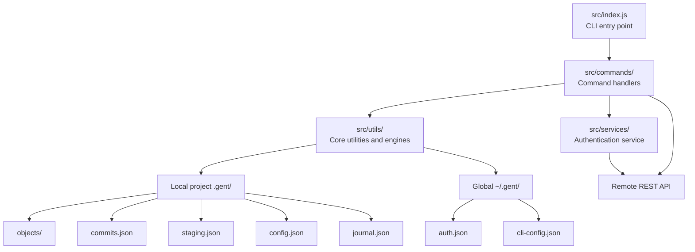
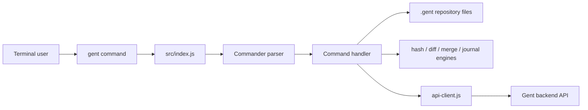
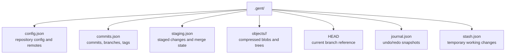
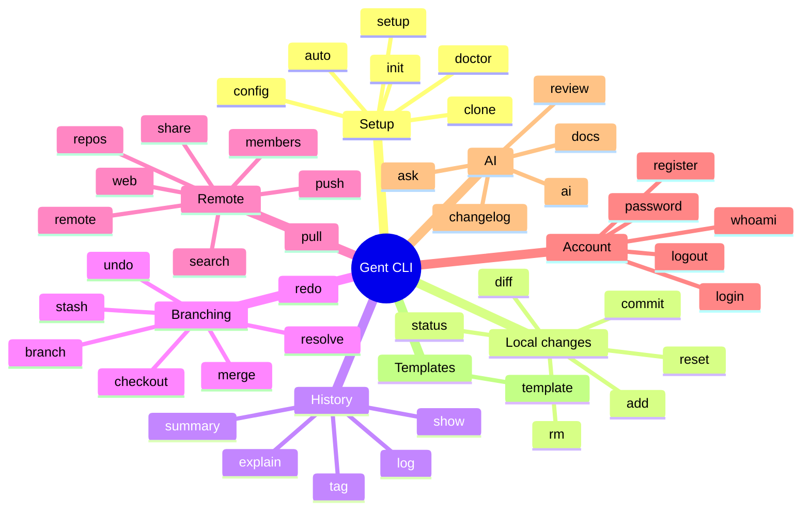
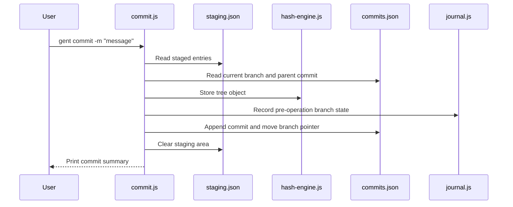
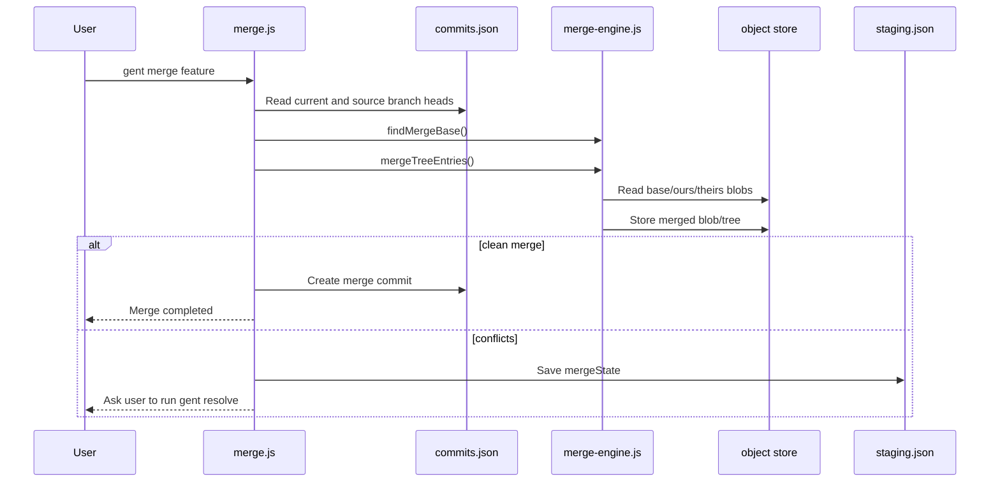
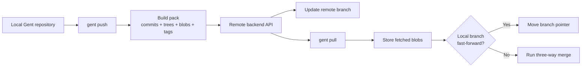
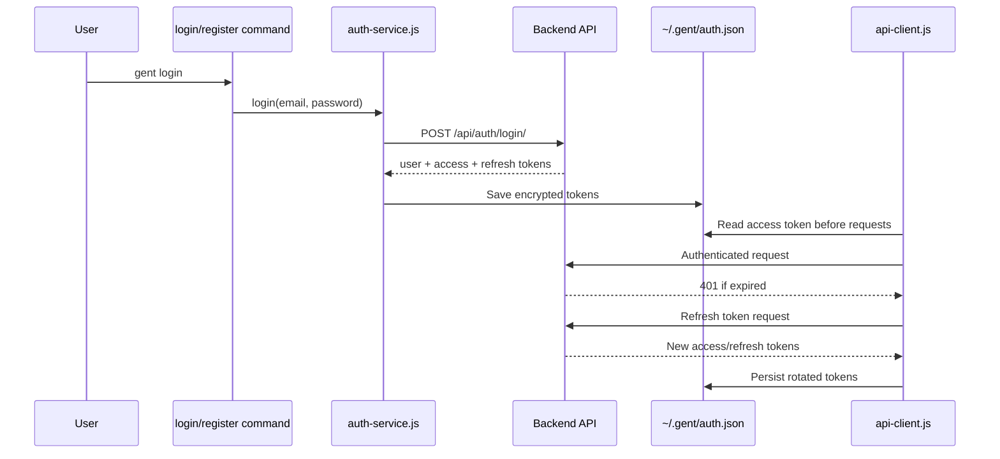

# 02 — System Architecture

## Architecture Summary

Gent CLI is organized into layers. The entry point parses commands, command modules coordinate workflows, utility engines perform core algorithms, and local files under `.gent/` store repository state.

## Main Source Folders

| Path | Responsibility |
|---|---|
| `src/index.js` | Registers every CLI command using Commander.js and configures grouped help. |
| `src/commands/` | One module per user command, such as `add`, `commit`, `merge`, `push`, and `login`. |
| `src/utils/` | Reusable engines and helpers: hashing, diffing, merging, API client, storage, config, journal, AI. |
| `src/services/` | Service wrappers, currently authentication operations. |
| `tests/` | Unit and end-to-end tests. |
| `docs/` | Existing technical documentation. |
| `final-year-documentation/` | This final-year report package. |

## Runtime Command Flow

When the user runs a command:

1. Node executes `src/index.js` through the `gent` binary.
2. Commander.js parses the command name, arguments, and options.
3. The matching file in `src/commands/` runs.
4. The command reads local repository files from `.gent/`.
5. The command uses utility engines when algorithms are required.
6. If the command is remote/auth-related, it calls the backend through `api-client.js`.
7. The command prints a result to the terminal.

## Layer Responsibilities

| Layer | Modules | Main Responsibility |
|---|---|---|
| CLI entry | `src/index.js` | Define command names, options, help groups, and global error handling. |
| Command layer | `src/commands/*.js` | Implement user workflows and coordinate storage/engines/API calls. |
| Engine layer | `hash-engine.js`, `diff-engine.js`, `merge-engine.js`, `journal.js` | Implement core version-control algorithms. |
| Storage layer | `fileSystem.js`, `.gent/*` | Read and write repository data. |
| Config/auth layer | `auth-storage.js`, `user-config.js`, `auth-service.js` | Store user identity, tokens, API URL, and AI config. |
| Network layer | `api-client.js`, `constants.js` | Communicate with backend endpoints using JWT authentication. |
| Optional AI layer | `ai-service.js` | Generate explanations, reviews, docs, changelogs, and commit messages if configured. |

## Local Repository Architecture

Each initialized project has a `.gent/` directory.

## Important Local Files

| File | Used By | Description |
|---|---|---|
| `.gent/config.json` | Remote, commit, init, push, pull | Repository metadata, user identity, remotes, and remote refs. |
| `.gent/commits.json` | Commit, log, branch, merge, checkout | Commit history, branch pointers, current branch, and tags. |
| `.gent/staging.json` | Add, status, diff, commit, resolve | Staged entries and active merge state. |
| `.gent/objects/` | Hash engine, commit, checkout, merge, push, pull | Compressed content-addressed blob and tree objects. |
| `.gent/journal.json` | Undo, redo | Operation history for recovery. |
| `.gent/stash.json` | Stash | Saved working-tree changes. |
| `.gentignore` | Add, status | Ignore rules for scanning working files. |

## Command Categories

## Commit Creation Architecture

## Branch Merge Architecture

## Remote Synchronization Architecture

## Authentication Architecture

Gent stores encrypted/obfuscated authentication state in the user-level `.gent` directory.

## Design Strengths

| Strength | Explanation |
|---|---|
| Modular design | Each command is isolated in its own file, making the code easier to maintain. |
| Clear engine separation | Hashing, diffing, merging, and journaling are reusable and testable. |
| Local-first behavior | Core commands work offline; remote commands are optional. |
| Recoverability | Journal-based undo/redo reduces risk during history operations. |
| Educational value | Algorithms are implemented directly rather than hidden behind Git libraries. |
| Extensibility | New commands can be added by creating a command module and registering it in `index.js`. |

