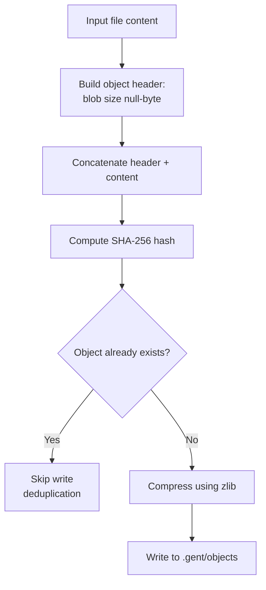
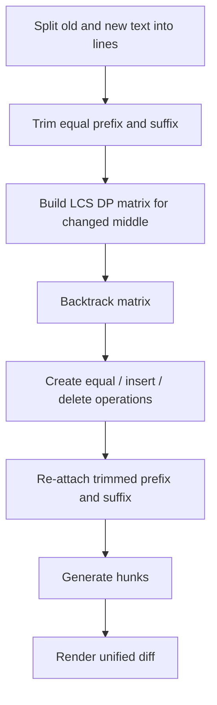
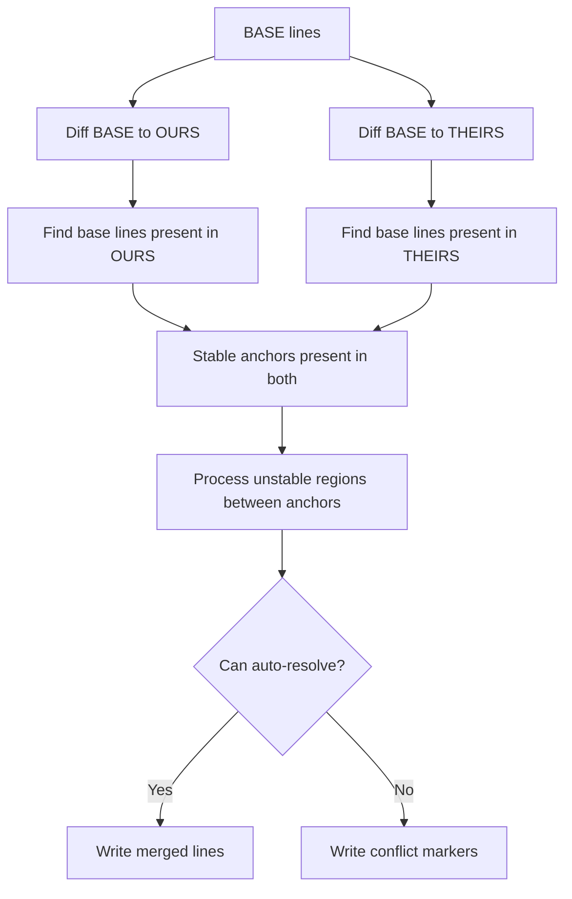
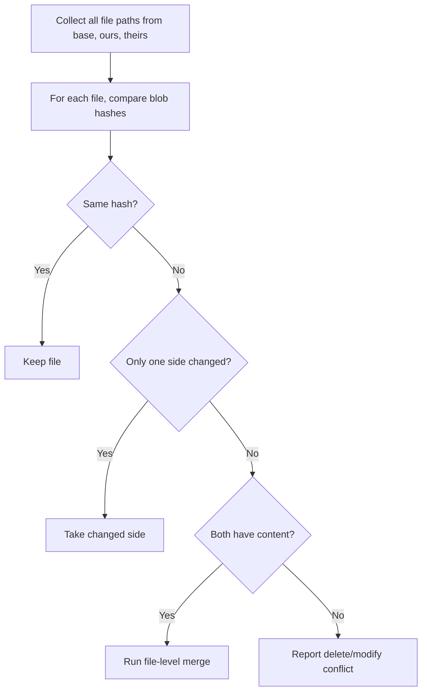
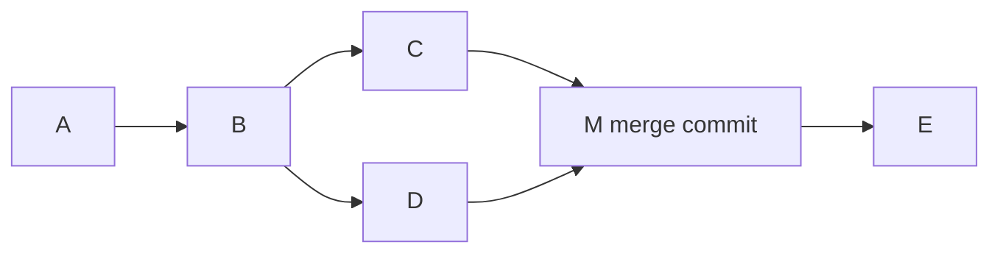
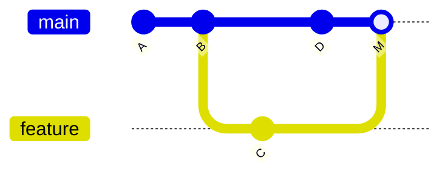
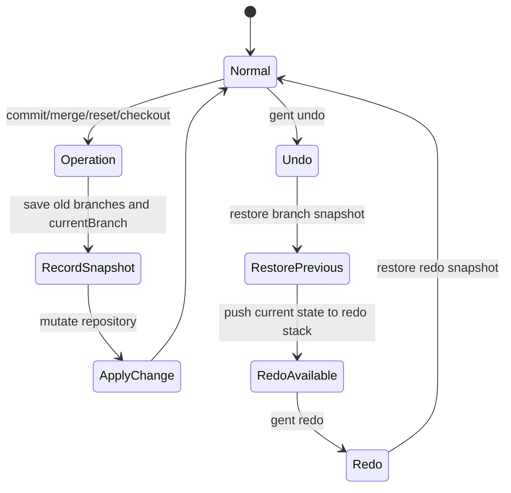
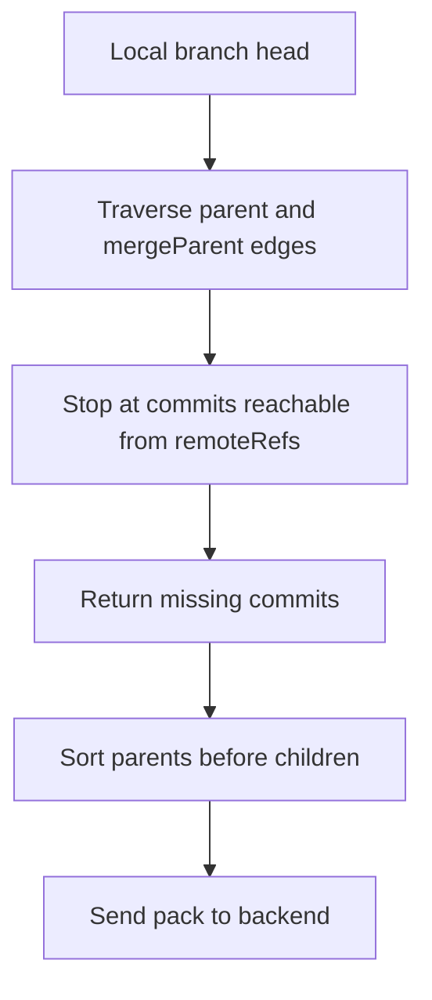
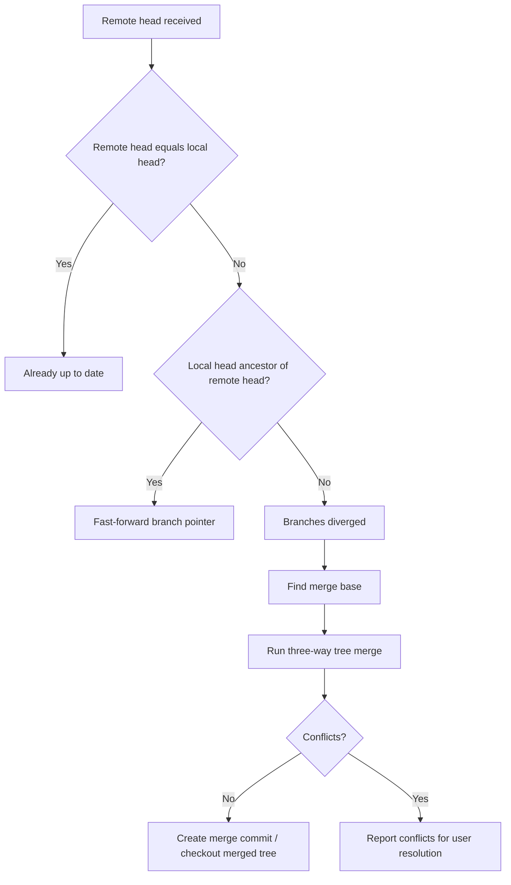

# 03 — Algorithms Used in Gent CLI

This file explains the important algorithms used in the project. It is the most important technical document for the final-year defense.

## Algorithm Summary Table

| Algorithm / Technique | Source File | Used For | Complexity |
|---|---|---|---|
| SHA-256 object hashing | `src/utils/hash-engine.js` | Blob/tree identity and integrity | `O(n)` time, `O(n)` space |
| Zlib compression | `src/utils/hash-engine.js` | Reduce object store size | `O(n)` |
| Deterministic tree serialization | `src/utils/hash-engine.js` | Stable tree hashes | `O(k log k)` for sorting entries |
| FNV-1a 32-bit line hashing | `src/utils/hash-engine.js` | Fast line fingerprints | `O(n)` |
| LCS dynamic programming diff | `src/utils/diff-engine.js` | Line-level diff operations | `O(m*n)` |
| Prefix/suffix trimming | `src/utils/diff-engine.js` | Optimize LCS for localized edits | `O(p+s)` scan, reduces matrix size |
| Unified diff hunk generation | `src/utils/diff-engine.js` | Human-readable diffs | `O(d)` over diff operations |
| diff3 three-way merge | `src/utils/merge-engine.js` | Branch/file merge | Based on two LCS diffs |
| JSON three-way key merge | `src/utils/merge-engine.js` | Auto-merge JSON files | `O(k)` keys recursively |
| Import/require union | `src/utils/merge-engine.js` | Avoid false import conflicts | `O(a+b)` |
| DAG merge-base search | `src/utils/merge-engine.js` | Find common ancestor commit | `O(V+E)` |
| Journal snapshots | `src/utils/journal.js` | Undo/redo history operations | `O(branch count)` for refs, plus tree restore when needed |
| Push reachability traversal | `src/commands/push.js` | Select commits remote does not have | `O(V+E)` |
| Pull fast-forward detection | `src/commands/pull.js` | Decide whether to merge | `O(history length)` |
| Ignore pattern matching | `src/utils/fileSystem.js` | Skip ignored files | `O(files * patterns)` |
| JWT refresh queue | `src/utils/api-client.js` | Avoid duplicate refresh requests | `O(waiting requests)` |

---

## 1. SHA-256 Content-Addressed Object Storage

### Purpose

Gent stores file contents and tree snapshots as objects. Each object is identified by a SHA-256 hash of its content. This is called content-addressable storage.

### Object Format

Before hashing, Gent creates a Git-like object body:

```text
<type> <byte-length>\0<raw-content>
```

Example:

```text
blob 11\0hello world
```

The SHA-256 hash of this full object body becomes the object key.

### Storage Path

Gent splits the hash into a two-character directory prefix:

```text
.gent/objects/<first-2-hash-chars>/<remaining-hash-chars>
```

Example:

```text
.gent/objects/ab/cdef1234567890...
```

### Algorithm Steps



### Why SHA-256?

| Reason | Explanation |
|---|---|
| Deterministic | Same content always gives the same hash. |
| Integrity | Corruption can be detected by recalculating the hash. |
| Deduplication | Same content is stored once. |
| Stronger than SHA-1 | SHA-1 has known collision attacks; SHA-256 is safer. |

### Pseudocode

```text
function storeBlob(content):
    bytes = encode(content)
    objectBody = "blob " + bytes.length + "\0" + bytes
    hash = SHA256(objectBody)
    path = ".gent/objects/" + hash[0:2] + "/" + hash[2:]

    if path exists:
        return hash

    compressed = zlib.deflate(objectBody)
    write(path, compressed)
    return hash
```

---

## 2. Deterministic Tree Hashing

### Purpose

A tree object represents a snapshot of all tracked files in a commit. Each tree entry stores:

- File mode.
- File path.
- Blob hash.
- Object type.

### Important Detail

Before hashing a tree, Gent sorts entries by name. This makes the tree hash independent of filesystem scan order.

### Example

These two arrays produce the same tree hash:

```json
[
  { "name": "b.js", "hash": "h2" },
  { "name": "a.js", "hash": "h1" }
]
```

```json
[
  { "name": "a.js", "hash": "h1" },
  { "name": "b.js", "hash": "h2" }
]
```

### Algorithm

```text
function hashTree(entries):
    sorted = sort entries by name
    json = JSON.stringify(sorted)
    return hashObject("tree", json)
```

---

## 3. FNV-1a 32-bit Line Hashing

### Purpose

Gent includes a fast non-cryptographic hash for line-level fingerprints. It is used for speed-sensitive comparison and diagnostics, not for security.

### Algorithm Idea

FNV-1a starts with a fixed offset value, then for each character:

1. XOR the hash with the character code.
2. Multiply by a fixed prime.
3. Keep the result as a 32-bit unsigned value.

### Important Limitation

FNV-1a is not collision-resistant. It must not be used for object identity, security, or integrity. Gent uses SHA-256 for those tasks.

---

## 4. LCS Line Diff Algorithm

### Purpose

Gent needs to show what changed between two versions of a file. It uses the Longest Common Subsequence algorithm to identify unchanged, inserted, and deleted lines.

### Inputs

```text
oldLines = lines from old file
newLines = lines from new file
```

### Output

A sequence of operations:

| Operation | Meaning |
|---|---|
| `equal` | Line exists unchanged in both versions. |
| `delete` | Line exists only in the old version. |
| `insert` | Line exists only in the new version. |

### Dynamic Programming Rule

```text
if old[i-1] == new[j-1]:
    dp[i][j] = dp[i-1][j-1] + 1
else:
    dp[i][j] = max(dp[i-1][j], dp[i][j-1])
```

### Backtracking Rule

```text
if old[i-1] == new[j-1]:
    emit equal
    move diagonally
else if left cell >= upper cell:
    emit insert
    move left
else:
    emit delete
    move up
```

### Diagram



### Complexity

If `m` is the number of old lines and `n` is the number of new lines:

| Metric | Complexity |
|---|---|
| Time | `O(m*n)` |
| Space | `O(m*n)` |

Gent uses `Uint32Array` rows to reduce memory overhead.

---

## 5. Prefix/Suffix Trimming Optimization

### Problem

The full LCS matrix can be large for big files. In real projects, many edits are local: only a few lines change while most lines stay the same.

### Solution

Before running LCS, Gent removes:

- Equal lines at the beginning.
- Equal lines at the end.

Then it runs LCS only on the changed middle.

### Example

```text
old = [A, B, C, D, E]
new = [A, B, X, D, E]
```

Common prefix: `[A, B]`  
Common suffix: `[D, E]`  
LCS only runs on `[C]` and `[X]`.

### Benefit

The final diff stays correct, but the DP matrix is much smaller.

---

## 6. Unified Diff Hunk Generation

### Purpose

Raw insert/delete/equal operations are hard to read. Gent groups nearby changes into hunks and prints a standard unified diff.

### Hunk Header Format

```text
@@ -oldStart,oldCount +newStart,newCount @@
```

### Line Prefixes

| Prefix | Meaning |
|---|---|
| Space | Context line, unchanged. |
| `-` | Deleted line. |
| `+` | Inserted line. |

### Algorithm

1. Find all changed operation indexes.
2. Group changes that are close together.
3. Add context lines around each group.
4. Count old and new line ranges.
5. Print hunk headers and lines.

---

## 7. Three-Way Merge / diff3 Algorithm

### Purpose

When two branches change the same file, Gent must combine the changes. It uses a three-way merge algorithm.

### Inputs

| Input | Meaning |
|---|---|
| `BASE` | Common ancestor version. |
| `OURS` | Current branch version. |
| `THEIRS` | Incoming branch version. |

### Main Idea

The base file is used as a reference. Gent compares:

- `BASE -> OURS`
- `BASE -> THEIRS`

Then it identifies stable anchor lines that survived unchanged in both sides.

### Diagram



### Region Resolution Rules

| Situation | Result |
|---|---|
| Neither side changed | Keep base. |
| Only ours changed | Take ours. |
| Only theirs changed | Take theirs. |
| Both changed identically | Take either side. |
| Both changed same-length lines with non-overlap | Sub-merge line by line. |
| Whitespace-only difference | Take ours. |
| Both add imports at the same place | Union import lines. |
| True overlapping change | Emit conflict markers. |

### Conflict Marker Format

```text
<<<<<<< ours
our version
=======
their version
>>>>>>> theirs
```

### Why This Is Better Than a Two-Way Merge

A two-way merge only compares ours and theirs. A three-way merge also knows the original base version, so it can tell whether:

- Only one side changed a line.
- Both sides made the same change.
- Both sides changed the same region differently.

---

## 8. Sub-Merge Algorithm

### Purpose

Sometimes both sides changed the same unstable region, but the individual changed lines do not conflict. Gent tries a finer line-by-line merge before declaring a conflict.

### Rules

For each line position:

| Case | Result |
|---|---|
| Ours equals theirs | Keep the line. |
| Ours equals base | Take theirs. |
| Theirs equals base | Take ours. |
| Ours and theirs only differ in whitespace | Take ours. |
| Otherwise | Conflict. |

This reduces unnecessary conflicts while staying safe.

---

## 9. JSON-Aware Three-Way Merge

### Purpose

JSON files are common in Node.js projects, especially `package.json`. Line-based merge can create conflicts when two branches edit different keys. Gent tries a structure-aware JSON merge first.

### Example

Base:

```json
{
  "version": "1.0.0",
  "dependencies": {
    "a": "1"
  }
}
```

Ours changes version:

```json
{
  "version": "1.1.0",
  "dependencies": {
    "a": "1"
  }
}
```

Theirs adds dependency:

```json
{
  "version": "1.0.0",
  "dependencies": {
    "a": "1",
    "b": "2"
  }
}
```

Merged result:

```json
{
  "version": "1.1.0",
  "dependencies": {
    "a": "1",
    "b": "2"
  }
}
```

### Algorithm

1. Parse base, ours, and theirs as JSON.
2. Ensure roots are plain objects.
3. Visit every key appearing in any version.
4. For each key:
   - If neither side changed it, keep base.
   - If only ours changed it, take ours.
   - If only theirs changed it, take theirs.
   - If both changed to the same value, keep that value.
   - If both values are objects, recursively merge.
   - Otherwise, mark conflict.
5. If any conflict exists, return `null` and fall back to line-based merge.

### Safety Principle

Gent only auto-merges JSON when it can resolve every key safely. If uncertain, it falls back to conflict markers.

---

## 10. Import/Require Union Algorithm

### Purpose

Many false conflicts happen when two branches add different imports at the same location. Gent detects import-like regions and unions them.

### Supported Import Patterns

Gent recognizes common import styles:

- JavaScript/TypeScript `import`
- `require(...)`
- Python `import` and `from ... import`
- C/C++ `#include`
- C# `using`
- Rust `use`
- CSS `@import`

### Algorithm

```text
if base segment is empty
and all non-blank ours lines are imports
and all non-blank theirs lines are imports:
    output all ours lines
    append theirs lines that are not already present
else:
    use normal merge rules
```

---

## 11. Tree-Level Merge Algorithm

### Purpose

A commit tree contains many files. Gent merges trees file by file before deciding whether file content needs a three-way merge.

### Inputs

- Base tree entries.
- Ours tree entries.
- Theirs tree entries.

### Algorithm Table

| File State | Result |
|---|---|
| Ours hash equals theirs hash | Keep either hash. |
| Ours unchanged from base, theirs changed | Take theirs. |
| Theirs unchanged from base, ours changed | Take ours. |
| Both changed and file exists in all trees | Run content merge. |
| One side deleted and other modified | Keep modified version and report modify/delete conflict. |
| Both added different content | Run content merge with empty base. |

### Diagram



---

## 12. Merge-Base Algorithm for Commit DAG

### Purpose

To perform a three-way merge, Gent must find the common ancestor of two branch heads.

Commits form a Directed Acyclic Graph because merge commits can have two parents:

- `parent`
- `mergeParent`

### Algorithm

1. Build a map of commit hash to commit object.
2. Traverse all ancestors of branch A using both `parent` and `mergeParent`.
3. Store those ancestors in a set.
4. Start BFS from branch B.
5. The first commit also found in A's ancestor set is the nearest common ancestor.

### Diagram



For tips `E` and `D`, the merge base is `D` because `D` is reachable through `M.mergeParent`.

### Complexity

| Metric | Complexity |
|---|---|
| Time | `O(V+E)` |
| Space | `O(V)` |

Where `V` is commits and `E` is parent edges.

---

## 13. Commit Creation Algorithm

### Purpose

A commit captures a snapshot of staged changes and links it to the previous commit.

### Algorithm

```text
gent commit:
    read staging.json
    validate staged changes exist
    resolve author identity
    read parent commit from current branch
    start tree from parent tree
    overlay staged entries
    delete entries staged as deleted
    store new tree object
    calculate insert/delete stats
    create commit object
    record journal snapshot
    append commit to commits.json
    move current branch pointer
    clear staging.json
```

### Commit Graph



---

## 14. Undo/Redo Journal Algorithm

### Purpose

Gent provides a safer workflow by allowing users to undo history-changing operations.

### Operations Recorded

Examples:

- Commit.
- Merge.
- Checkout.
- Reset.
- Branch delete.
- Pull fast-forward/merge.

### Journal Model

The journal stores:

- Operation name.
- Description.
- Timestamp.
- Previous branch map.
- Previous current branch.
- Optional restore-tree flag.

### Algorithm



### Why Snapshot Refs Instead of Writing Custom Reverse Logic?

Because many commands modify branch pointers. A generic snapshot of branch refs and current branch can reverse many operations without writing a different inverse algorithm for each command.

---

## 15. Push Algorithm

### Purpose

Push sends local commits and objects to the remote backend.

### Algorithm

1. Check authentication.
2. Resolve remote name and branch name.
3. Parse remote path `/api/repos/<owner_id>/<repo_name>`.
4. Read local branch head.
5. Determine remote boundary using `config.remoteRefs`.
6. Traverse commits reachable from local head.
7. Exclude commits already reachable from remote refs.
8. Collect tree hashes and blob hashes.
9. Read objects and encode blobs as base64.
10. Send a pack payload to the backend.
11. Update local `remoteRefs`.

### Push Pack Contents

| Pack Section | Contains |
|---|---|
| `commits` | Commit metadata, tree hash, parents, author, date. |
| `trees` | Tree entries mapping paths to blob hashes. |
| `blobs` | File contents encoded as base64. |
| `branch_updates` | Branch name and new commit SHA. |
| `tags` | Tags whose target commits exist remotely or in this push. |

### Commit Selection Diagram



---

## 16. Pull Algorithm

### Purpose

Pull downloads remote commits and integrates them into the local branch.

### Algorithm

1. Check authentication.
2. Resolve remote and branch.
3. Request remote commits and objects using current local head as `since`.
4. Store downloaded blobs in local object store.
5. Add new commits to `commits.json`.
6. If local head is ancestor of remote head, fast-forward.
7. Otherwise, find merge base and run tree-level merge.
8. Update `remoteRefs`.

### Pull Decision Tree



---

## 17. JWT Token Refresh Queue Algorithm

### Purpose

Authenticated API requests may fail with HTTP 401 when an access token expires. Gent automatically refreshes the token using the refresh token.

### Problem

If many requests fail at the same time, every request could try to refresh the token. That causes duplicate refresh calls and race conditions.

### Solution

Gent uses:

- `isRefreshing`: boolean lock.
- `failedRequestsQueue`: waiting requests.

### Algorithm

```text
on 401 response:
    if request already retried:
        reject

    if refresh is already running:
        wait in queue
        retry when new token is available

    else:
        mark refresh running
        send refresh request
        save new access and refresh tokens
        wake queued requests
        retry original request
```

---

## 18. Ignore Pattern Matching Algorithm

### Purpose

Gent must avoid tracking files such as `.gent`, `node_modules`, build output, logs, and environment files.

### Sources of Ignore Rules

- Built-in default patterns.
- User-defined `.gentignore`.

### Matching Rules

| Pattern Type | Example | Meaning |
|---|---|---|
| Exact path | `.gent` | Ignore that exact path or nested paths. |
| Wildcard | `*.log` | Convert `*` into a regex wildcard. |
| Extension | `*.env` | Ignore files ending with extension pattern. |

### Algorithm

```text
for each file:
    normalize path separators to "/"
    for each pattern:
        if exact match or nested path:
            ignore
        if wildcard regex matches:
            ignore
        if extension pattern matches:
            ignore
    otherwise include file
```

---

## 19. Optional AI Fallback Algorithm

### Purpose

Gent provides AI-assisted commands, but the project must still work without AI.

### Safety Rule

AI is optional. It never replaces core algorithms such as hashing, diffing, committing, or merging.

### Behavior

| Situation | Result |
|---|---|
| AI key exists and request succeeds | Print AI result. |
| AI key missing | Print helpful setup message or use non-AI behavior. |
| AI request fails | Fall back to algorithmic output where possible. |

### Examples

- `gent commit --ai`: asks AI for a commit message, but falls back to manual input.
- `gent explain`: can use AI for explanation, but can show a diff without AI.
- `gent resolve`: can ask AI for a hunk suggestion, but user can choose ours/theirs/both/edit.

---

## 20. Algorithm Quality and Limitations

| Area | Strength | Limitation |
|---|---|---|
| Hashing | Strong SHA-256 identity and deduplication. | Commit hash generation uses timestamp/random rather than hashing full commit content. |
| Diff | Correct LCS-based line diff with optimization. | `O(m*n)` can still be expensive for very large changed regions. |
| Merge | Handles common branch merge cases and reduces false conflicts. | Cannot understand all programming language semantics. |
| JSON merge | Safely merges disjoint object key changes. | Falls back for arrays or conflicting same-key changes. |
| Undo/redo | Simple and effective for branch pointer changes. | It is not a full filesystem snapshot system. |
| Remote sync | Sends compact object pack and tracks remote refs. | Depends on backend API compatibility and authentication. |

