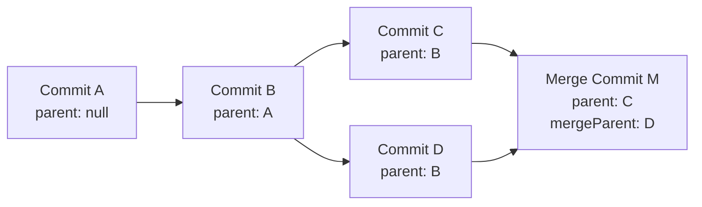
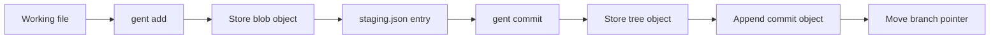
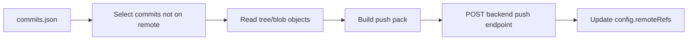

# 05 — Data Models and Storage

## Storage Overview

Gent uses two storage locations:

| Location | Scope | Purpose |
|---|---|---|
| Project `.gent/` | Per repository | Stores commits, staging state, branches, tags, objects, journal, and remote config. |
| User `~/.gent/` | Global user | Stores authentication tokens and CLI config. |

## Project `.gent/` Layout

```text
.gent/
├── config.json
├── commits.json
├── staging.json
├── journal.json
├── stash.json
├── HEAD
├── objects/
│   ├── ab/
│   │   └── cdef...
│   └── ...
└── refs/
    ├── heads/
    └── tags/
```

## `config.json`

Stores project metadata, author identity, remotes, and known remote branch refs.

Example:

```json
{
  "user": {
    "name": "Student Name",
    "email": "student@example.com"
  },
  "repository": {
    "name": "my-project",
    "description": "A gent repository"
  },
  "remotes": {
    "origin": {
      "url": "/api/repos/2/my-project"
    }
  },
  "remoteRefs": {
    "origin/main": "commit_hash"
  }
}
```

## `commits.json`

Stores local version history.

Main fields:

| Field | Description |
|---|---|
| `commits` | Array of commit objects. |
| `branches` | Map from branch name to commit hash. |
| `currentBranch` | Active branch name. |
| `tags` | Map of tag names to tag metadata. |

Example commit:

```json
{
  "hash": "commit_hash",
  "message": "Initial commit",
  "author": {
    "name": "Student Name",
    "email": "student@example.com"
  },
  "timestamp": "2026-08-17T10:00:00.000Z",
  "parent": null,
  "mergeParent": null,
  "treeHash": "tree_hash",
  "tree": [
    {
      "mode": "100644",
      "name": "src/index.js",
      "hash": "blob_hash",
      "type": "blob"
    }
  ],
  "files": [
    {
      "path": "src/index.js",
      "hash": "blob_hash"
    }
  ],
  "stats": {
    "filesChanged": 1,
    "insertions": 20,
    "deletions": 0
  }
}
```

## Commit Graph Model



## `staging.json`

Stores staged changes before commit.

Important fields:

| Field | Description |
|---|---|
| `entries` | Detailed staged file entries. |
| `files` | Legacy/simple staged file list. |
| `mergeState` | Active merge metadata when conflicts exist. |

Example:

```json
{
  "entries": [
    {
      "path": "app.js",
      "hash": "blob_hash",
      "status": "modified",
      "binary": false,
      "stats": {
        "insertions": 3,
        "deletions": 1
      }
    }
  ],
  "files": [
    "app.js"
  ],
  "mergeState": null
}
```

## Object Store Model

Objects are compressed on disk. The decompressed content contains:

```text
<type> <size>\0<content>
```

| Object Type | Content |
|---|---|
| `blob` | Raw file bytes. |
| `tree` | JSON array of tree entries. |

## Tree Entry Model

```json
{
  "mode": "100644",
  "name": "README.md",
  "hash": "blob_hash",
  "type": "blob"
}
```

## Tag Model

Tags are stored in `commits.json`.

```json
{
  "v1.0.0": {
    "hash": "commit_hash",
    "message": "First stable version",
    "annotated": true
  }
}
```

## Journal Model

The journal supports undo and redo.

```json
{
  "entries": [
    {
      "op": "commit",
      "description": "Initial commit [main]",
      "timestamp": "2026-08-17T10:00:00.000Z",
      "before": {
        "branches": {
          "main": null
        },
        "currentBranch": "main"
      }
    }
  ],
  "redo": []
}
```

## User-Level Auth Storage

Authentication data is stored in:

```text
~/.gent/auth.json
```

It contains encrypted token data:

- Access token.
- Refresh token.
- User profile.
- Timestamp.

Important note for the defense: the code uses AES obfuscation with a fixed key. This is acceptable for a student project demonstration, but a production system should use the operating system keychain or a secure secret manager.

## User-Level CLI Config

Global config is stored in:

```text
~/.gent/cli-config.json
```

Supported keys:

| Key | Meaning |
|---|---|
| `ai.api_key` | Anthropic API key, obfuscated when stored. |
| `ai.model` | AI model name. |
| `api.base_url` | Backend API base URL. |
| `user.name` | Default author name. |
| `user.email` | Default author email. |

Resolution order:

```text
environment variable > ~/.gent/cli-config.json > built-in default
```

## Remote Push Payload

`gent push` sends a pack to the backend.

```json
{
  "pack": {
    "commits": [],
    "trees": [],
    "blobs": []
  },
  "branch_updates": [
    {
      "name": "main",
      "commit_sha": "commit_hash"
    }
  ],
  "tags": {}
}
```

## Remote Pull Payload

`gent pull` expects the backend to return:

```json
{
  "head": "remote_head_hash",
  "commits": [],
  "objects": [
    {
      "type": "blob",
      "data": "base64_content"
    }
  ]
}
```

## Data Flow: Add to Commit



## Data Flow: Push to Remote



