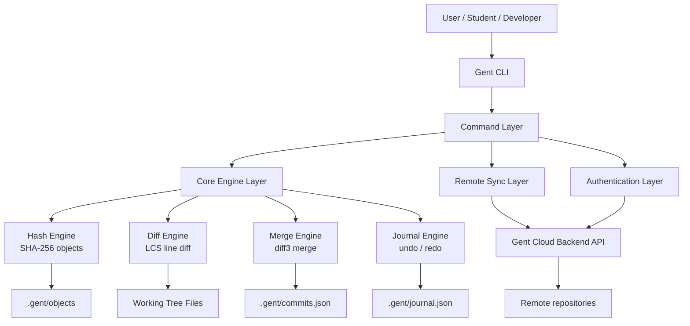

# Gent CLI Final-Year Project Documentation

This folder contains the complete documentation package for presenting and explaining the Gent CLI project.

Gent CLI is a Git-like version control command-line application written in Node.js. It supports local repository management, staging, commits, branches, merges, undo/redo, cloud synchronization, authentication, repository collaboration, and optional AI-assisted features.

## Documentation Map

| File | Purpose |
|---|---|
| [01-project-overview.md](01-project-overview.md) | Explains the problem, objectives, project scope, technology stack, and major features. |
| [02-system-architecture.md](02-system-architecture.md) | Explains the CLI architecture, modules, local storage, remote API integration, and data flow charts. |
| [03-algorithms.md](03-algorithms.md) | Explains every important algorithm used in the project: hashing, object storage, diff, merge, merge-base, push/pull, undo/redo, ignore matching, token refresh, and AI fallback. |
| [04-command-reference.md](04-command-reference.md) | Explains all user-facing CLI commands, grouped by purpose. |
| [05-data-models-and-storage.md](05-data-models-and-storage.md) | Documents `.gent/` files, commit model, staging model, config model, remote payloads, and object format. |
| [06-testing-and-evaluation.md](06-testing-and-evaluation.md) | Explains test coverage, validation strategy, limitations, and future improvements. |
| [07-presentation-guide.md](07-presentation-guide.md) | Short defense/presentation guide with talking points and expected examiner questions. |

## Quick Summary

Gent CLI provides a simplified distributed version control system similar to Git, but designed for a final-year project demonstration with readable internals and modern usability features.

Main capabilities:

- Initialize a local repository using `gent init`.
- Track file changes with `gent add`, `gent status`, and `gent diff`.
- Store version history with `gent commit`, `gent log`, `gent show`, and `gent tag`.
- Work with branches using `gent branch`, `gent checkout`, and `gent merge`.
- Resolve conflicts with a custom diff3 merge engine and `gent resolve`.
- Recover from mistakes using `gent undo` and `gent redo`.
- Synchronize with a cloud backend using `gent push`, `gent pull`, and `gent clone`.
- Authenticate using `gent register`, `gent login`, `gent logout`, and `gent whoami`.
- Use optional AI functions such as `gent ask`, `gent review`, `gent docs`, `gent explain`, and `gent changelog`.

## Main System Diagram

## Recommended Reading Order

For the final-year project defense:

1. Start with [01-project-overview.md](01-project-overview.md).
2. Read [02-system-architecture.md](02-system-architecture.md) to understand the system modules.
3. Study [03-algorithms.md](03-algorithms.md) carefully; this is the most important technical file.
4. Use [04-command-reference.md](04-command-reference.md) to prepare a live demo.
5. Use [07-presentation-guide.md](07-presentation-guide.md) before the presentation.

